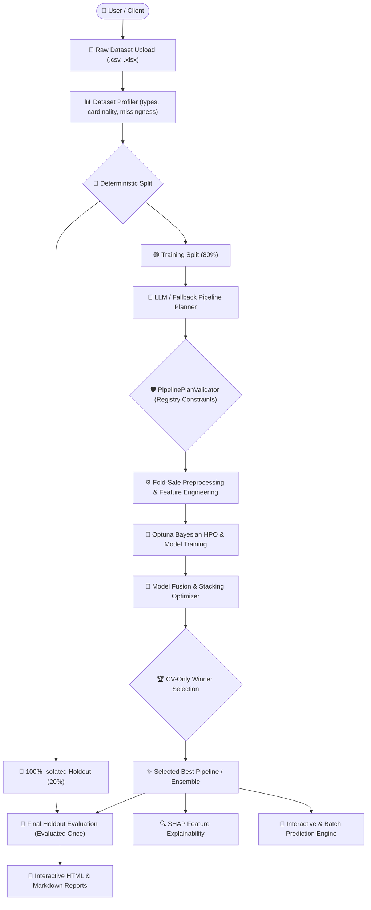

# AutoML-Lens

> **An LLM-guided structured AutoML framework with registry-constrained pipeline planning, fold-safe training, hyperparameter optimization, ensemble selection, explainability, and reproducible evaluation.**

[](https://python.org)
[](https://fastapi.tiangolo.com)
[](https://react.dev)
[](https://scikit-learn.org)
[](https://optuna.org)
[](tests/)
[](LICENSE)

---

## 1. Problem Statement

Standard Automated Machine Learning (AutoML) tools face fundamental structural bottlenecks:
1. **Combinatorial Inefficiency**: Exhaustive search over high-dimensional algorithm and hyperparameter spaces is computationally prohibitive on constrained hardware.
2. **Rigid Heuristics**: Deterministic rule sets rely on static row/column thresholds that fail to adapt to nuanced data semantics, feature interactions, or domain properties.
3. **Safety & Hallucination Risks in LLMs**: While Large Language Models exhibit strong contextual reasoning, directly prompting an LLM to generate executable Python code introduces critical failure modes: syntax errors, silent data leakage, invalid library calls, and arbitrary code execution vulnerabilities.

---

## 2. Research Motivation: LLMs as a Structured Decision Layer

AutoML-Lens addresses this dilemma by separating **intelligent planning** from **deterministic execution**:
- The LLM (Google Gemini, OpenAI, or a local deterministic fallback) acts strictly as a **structured planner**, outputting a declarative JSON pipeline specification (candidate model recommendations, mathematical feature operations, hyperparameter search priorities, and ensemble strategies).
- The pipeline plan is passed to a deterministic **`PipelinePlanValidator`** that constrains all requests to validated system registries (`ModelRegistry`, `OPERATION_REGISTRY`). Any unsupported model, hazardous transformation, or target-leakage operation is rejected or safely repaired.
- The validated plan is then executed by a **fold-safe AutoML engine**, ensuring that feature scalers, imputers, and transformers are fit strictly inside cross-validation folds.

---

## 3. End-to-End System Architecture



> **Strict Holdout Discipline**: The 20% holdout test partition is split immediately upon ingestion and remains completely untouched during feature engineering, cross-validation, hyperparameter tuning, and ensemble optimization. It is evaluated strictly once after final model selection.

---

## 4. Key Capabilities

- **Real Ingestion & Automatic Profiling**: Supports CSV and Excel spreadsheets with automatic delimiter detection, type inference (numerical, categorical, datetime, text), missingness auditing, and dataset suitability checks.
- **LLM Pipeline Planning**: Generates structured, schema-validated pipeline plans with provider support for Google Gemini, OpenAI, and a self-contained deterministic fallback (requiring zero API keys or external calls).
- **Registry-Constrained Safety**: Zero arbitrary code execution. Every model is verified against `ModelRegistry` (17 scikit-learn estimators across classification and regression) and feature operations against `OPERATION_REGISTRY`.
- **Fold-Safe Preprocessing**: Imputation, scaling, one-hot encoding, and feature transforms are fit strictly on training folds to completely prevent target leakage and data snooping.
- **Optuna Hyperparameter Optimization**: Bayesian optimization with Tree-structured Parzen Estimator (TPE) sampler over bounded parameter spaces.
- **Model Fusion & Stacking**: Greedy ensemble weight optimization and ridge-stacked meta-learners computed exclusively over out-of-fold (OOF) cross-validation predictions.
- **Model Explainability**: Model-agnostic TreeSHAP and KernelSHAP explanation summaries, beeswarm plots, and feature importance rankings.
- **Real-Time & Batch Prediction**: REST endpoints and interactive UI forms for single-sample inference and batch CSV scoring.
- **Provenance & Reproducibility**: End-to-end provenance tracking including dataset SHA-256 hash, Git commit revision, experiment seed, timestamp, and runtime configurations.

---

## 5. Research Evaluation & Empirical Findings

AutoML-Lens was subjected to a rigorous multi-seed empirical benchmark comparing three experimental conditions across an identical seed sequence (`[42, 123, 456]`):
1. **Condition A (`deterministic`)**: Deterministic heuristic AutoML baseline.
2. **Condition B (`llm_model_only` ablation)**: LLM candidate model selection only; default preprocessing and zero feature operations.
3. **Condition C (`llm_guided`)**: Full LLM pipeline planning (candidate models, feature operations, HPO focus, ensemble configuration).

### Measured Multi-Seed Results Matrix

| Dataset | Task | Primary Metric | Deterministic Baseline | LLM Model-Only (Ablation) | Full LLM-Guided Plan | Direction-Adjusted $\Delta$ |
| :--- | :--- | :---: | :---: | :---: | :---: | :---: |
| **UCI Adult Census** | Classification | `f1_weighted` $\uparrow$ | $0.8148 \pm 0.0187$ | $0.8220 \pm 0.0101$ | $0.8220 \pm 0.0101$ | **$+0.0072$** (LLM advantage) |
| **UCI Wine Quality Red** | Regression | `rmse` $\downarrow$ | $0.5544 \pm 0.0307$ | $0.5556 \pm 0.0298$ | $0.5556 \pm 0.0298$ | **$-0.0012$** (Deterministic advantage) |

### Key Scientific Takeaways
1. **Classification Improvement on Adult Census**: LLM-guided planning achieved a mean holdout F1 improvement of $+0.0072$. On seed 456, the LLM proposed `svm_clf`, which achieved holdout F1 of $0.8176$, winning over tree models.
2. **Deterministic Baseline Advantage on Wine Quality**: The deterministic baseline achieved slightly lower holdout RMSE ($-0.0012$) because its heuristic candidate set included `knn_reg`, which received weight ($w=0.30$) in the winning ensemble on seed 456.
3. **Ablation Findings**: Conditions B and C achieved identical aggregate holdout scores ($0.8220$ on Adult, $0.5556$ on Wine), demonstrating that under this experimental budget, performance deltas were governed primarily by **model candidate space selection** rather than automated feature engineering.
4. **Empirical Honesty**: The experimental data demonstrates that LLM-guided AutoML is **not** universally superior to deterministic AutoML. Rather, LLMs act as an adaptive heuristic that can identify competitive non-standard candidates while occasionally omitting useful heuristics.

For full research details, see [`docs/FINAL_RESULTS.md`](docs/FINAL_RESULTS.md) and [`docs/BENCHMARK_REPORT.md`](docs/BENCHMARK_REPORT.md).

---

## 6. Limitations & Scope Boundaries

- **Benchmark Scope**: Evaluated on 2 representative benchmark datasets across $N=3$ reproducible seeds; findings represent descriptive empirical evidence rather than asymptotic universality.
- **Model Registry Boundaries**: Constrained strictly to algorithms supported in `ModelRegistry` (scikit-learn linear models, tree ensembles, SVMs, KNN, Naive Bayes).
- **Safety Boundaries**: The system executes zero arbitrary Python code. All transformations are predefined declarative functions.
- **Explicit Exclusions**: This framework does **not** implement reinforcement learning (RL), automated neural architecture search (NAS), multimodal AutoML, or autonomous code generation.

---

## 7. Quick Start Guide

### Prerequisites
- **Python**: 3.11+
- **Node.js**: 18+
- *(Optional)* Google Gemini or OpenAI API key (the system runs out of the box with the deterministic fallback without keys).

### Installation & Execution

#### 1. Clone the Repository
```bash
git clone https://github.com/SruthiRagyari/AUTOML-LENS.git
cd AUTOML-LENS
```

#### 2. Backend Setup
```bash
cd backend
python -m venv .venv
# Windows:
.venv\Scripts\activate
# Linux/macOS:
# source .venv/bin/activate

pip install -r requirements.txt
cp .env.example .env

# Run FastAPI backend:
python -m uvicorn app.main:app --reload --port 8000
```

#### 3. Frontend Setup
```bash
cd ../frontend
npm install
npm run dev
```

The application is available at:
- **Frontend UI**: [http://localhost:5173](http://localhost:5173)
- **FastAPI Backend Swagger**: [http://localhost:8000/docs](http://localhost:8000/docs)
- **Health Endpoint**: [http://localhost:8000/api/health](http://localhost:8000/api/health)

---

## 8. Verification & Test Suite

The system includes a test suite covering holdout isolation, provenance, schema validation, metric direction contracts, Optuna HPO, ensembles, and API routes:

```bash
# Run backend test suite (285 tests):
python -m pytest tests -q

# Run frontend production build:
cd frontend
npm run build
```

---

## 9. Project Documentation Index

- [System Architecture & Flow Diagram](docs/ARCHITECTURE_DIAGRAM.md)
- [Comprehensive Project Technical Documentation](docs/PROJECT_DOCUMENTATION.md)
- [Academic Research Paper Draft](docs/RESEARCH_PAPER_DRAFT.md)
- [Final Multi-Seed Empirical Results](docs/FINAL_RESULTS.md)
- [Viva Examination Question Bank (50+ Questions)](docs/VIVA_QUESTIONS.md)
- [Presentation Slide Outline (14 Slides)](docs/PRESENTATION_OUTLINE.md)
- [Live Demonstration Script (7-10 Minutes)](docs/DEMO_SCRIPT.md)
- [Standalone HTML Research Report](docs/BENCHMARK_REPORT.html)

---

## 10. License

This project is licensed under the MIT License — see the [LICENSE](LICENSE) file for details.
