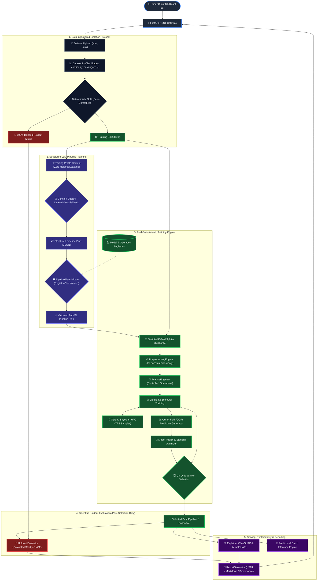

# AutoML-Lens: System Architecture & Workflow Diagram

This document illustrates the end-to-end technical architecture of **AutoML-Lens**, highlighting the strict separation between training/cross-validation and the untouched holdout test partition.

---

## 1. System Architecture Diagram (Mermaid)



---

## 2. Text / ASCII Architectural Flow

```
                      +------------------------------------------+
                      |         USER / FRONTEND CLIENT           |
                      |          (React 18 + Vite SPA)           |
                      +------------------------------------------+
                                           |
                                           v
                      +------------------------------------------+
                      |           FASTAPI REST GATEWAY           |
                      +------------------------------------------+
                                           |
                                           v
                      +------------------------------------------+
                      |         DATASET INGESTION & READ         |
                      |   (CSV / Excel, Delimiter Detection)     |
                      +------------------------------------------+
                                           |
                                           v
                      +------------------------------------------+
                      |             DATASET PROFILER             |
                      | (Shape, Types, Missingness, Cardinality) |
                      +------------------------------------------+
                                           |
                       +-------------------+--------------------+
                       |                                        |
                       v                                        v
        +-------------------------------+       +-------------------------------+
        |        TRAIN SPLIT (80%)      |       |       HOLDOUT SPLIT (20%)     |
        |   Used for CV, HPO & Ensembles|       |     STRICTLY ISOLATED UNTIL   |
        +-------------------------------+       |         FINAL EVALUATION      |
                       |                        +-------------------------------+
                       v                                        :
        +-------------------------------+                       :
        |  LLM PIPELINE PLANNER ENGINE  |                       :
        | (Gemini / OpenAI / Fallback)  |                       :
        +-------------------------------+                       :
                       |                                        :
                       v                                        :
        +-------------------------------+                       :
        |     PIPELINE PLAN VALIDATOR   |                       :
        | (Registry Constraints, Safety)|                       :
        +-------------------------------+                       :
                       |                                        :
                       v                                        :
        +-------------------------------+                       :
        |      FOLD-SAFE PREPROCESSING  |                       :
        |  (Fit strictly on train folds)|                       :
        +-------------------------------+                       :
                       |                                        :
                       v                                        :
        +-------------------------------+                       :
        |   CONTROLLED FEATURE OPS      |                       :
        |  (Mathematical transformations)                       :
        +-------------------------------+                       :
                       |                                        :
                       v                                        :
        +-------------------------------+                       :
        |   MODEL TRAINING & OPTUNA HPO |                       :
        |   (Tree, Linear, Kernel Models)                       :
        +-------------------------------+                       :
                       |                                        :
                       v                                        :
        +-------------------------------+                       :
        | MODEL FUSION & ENSEMBLE TUNING|                       :
        |  (Leakage-Free OOF Stacking)  |                       :
        +-------------------------------+                       :
                       |                                        :
                       v                                        :
        +-------------------------------+                       :
        |       CV-BASED SELECTION      |                       :
        |  (Winner chosen on CV score)  |                       :
        +-------------------------------+                       :
                       |                                        :
                       v                                        v
        +---------------------------------------------------------------+
        |                  FINAL HOLDOUT EVALUATION                     |
        |     (Evaluated strictly once on the untouched 20% holdout)    |
        +---------------------------------------------------------------+
                       |
                       +-------------------+--------------------+
                       |                   |                    |
                       v                   v                    v
        +---------------------+ +--------------------+ +-----------------+
        | SHAP EXPLAINABILITY | | REAL-TIME PREDICT  | | RESEARCH REPORT |
        | (Values & Plots)    | | (Single & Batch)   | | (HTML & MD)     |
        +---------------------+ +--------------------+ +-----------------+
```

---

## 3. Strict Holdout Isolation Contract

A core scientific guarantee of AutoML-Lens is **zero data leakage**:

1. **Pre-Planning Partition**: The dataset is split into `train` (80%) and `holdout` (20%) using a deterministic random seed before profiling context is passed to the LLM.
2. **Context Restriction**: The LLM prompt receives statistical summaries (column names, types, missing rates, value ranges) derived **strictly from the 80% training partition**. The holdout partition is invisible to the planner.
3. **Fold-Safe Isolation**: Inside the cross-validation loop, all imputation statistics, standardizers, one-hot encoders, and custom feature transforms are fit strictly on each fold's training slice ($K-1$ folds) and applied to the validation fold ($1$ fold).
4. **Post-Selection Evaluation**: Model ranking and ensemble weighting are determined exclusively by out-of-fold cross-validation performance. The 20% holdout split is evaluated **exactly once** after the final pipeline has been fixed.
